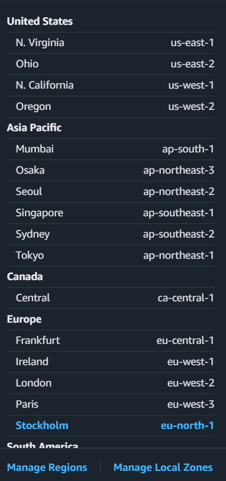

# Лабораторная работа №2. Введение в AWS. Вычислительные сервисы

# **1. Описание лабораторной работы**

Цель работы — познакомиться с основами управления облачной инфраструктурой AWS, включая создание пользователей и политик, настройку бюджетов, запуск виртуальных машин (EC2), развёртывание веб-приложений и безопасное подключение по SSH.

---

# ** Постановка задачи**

Необходимо выполнить следующие действия:

1. Создать IAM-группу и IAM-пользователя.
2. Настроить Zero-Spend Budget для контроля расходов.
3. Развернуть и настроить виртуальную машину EC2.
4. Запустить веб-сервер Nginx и разместить статический сайт.
5. Подключиться к виртуальной машине по SSH.
6. Развернуть сайт на PHP.
7. Остановить EC2 через AWS CLI и объяснить разницу между Stop и Terminate.

---

# ** Цель и основные этапы работы**

**Цель:** получить первичные навыки работы с AWS и научиться разворачивать веб-приложение в облаке.

**Основные этапы:**

1. Работа с IAM.
2. Настройка бюджета для предотвращения расходов.
3. Развёртывание EC2.
4. Установка ПО через User Data.
5. Подключение по SSH.
6. Загрузка сайта и настройка PHP.
7. Остановка EC2.

---

# **2. Практическая часть**

---

## **4.2. Задание 1 — Создание IAM-группы и пользователя**

1. Открыла сервис IAM.
2. Создала группу **Admins**.
3. Привязала политику **AdministratorAccess**.

**Ответ: Что делает политика AdministratorAccess?**
Даёт полный доступ ко всем сервисам AWS.

4. Создала IAM-пользователя **cloudstudent**, разрешила вход в консоль.
5. Вышла из root-аккаунта и вошла под IAM-пользователем.

**Скрин:**
– IAM группа
– Политика
– Созданный пользователь
– Успешный вход

---
